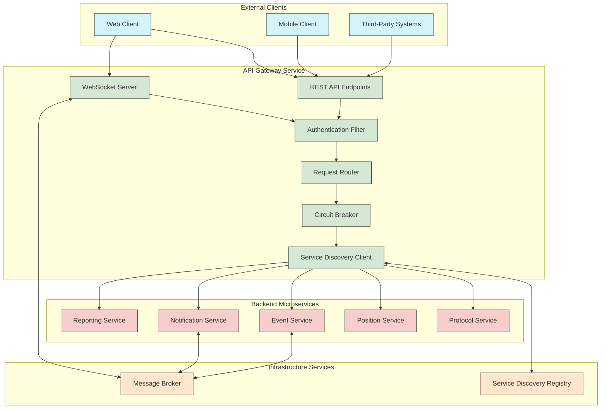
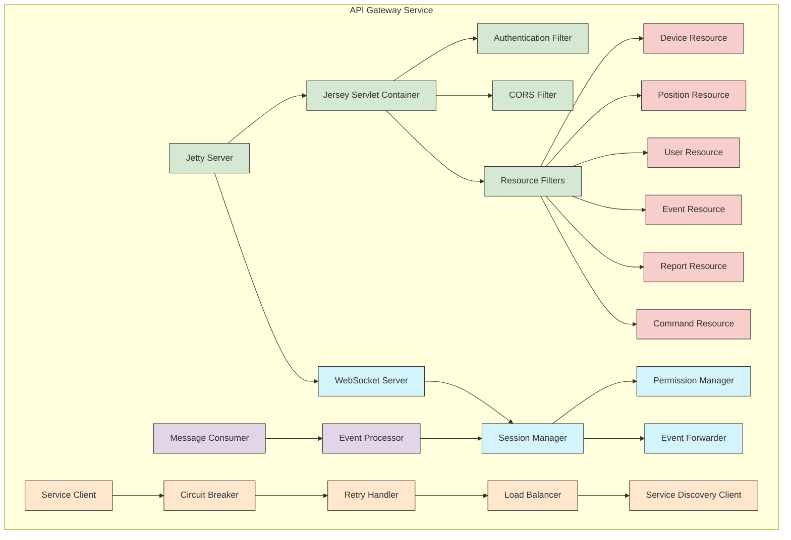
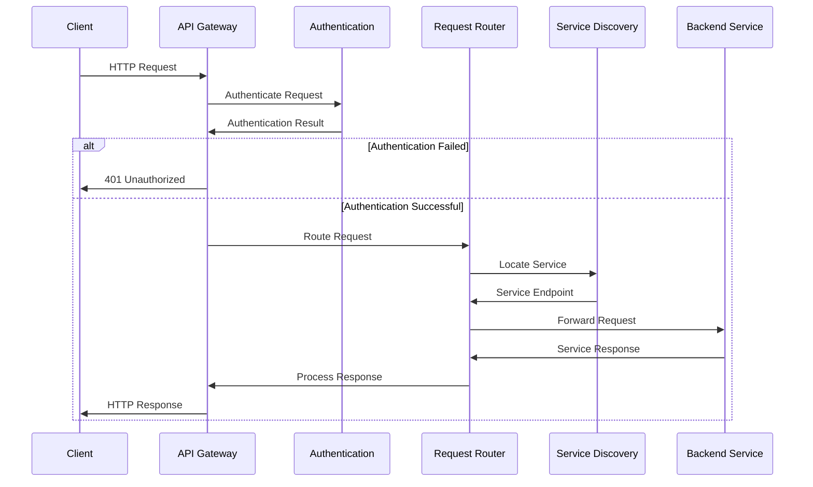
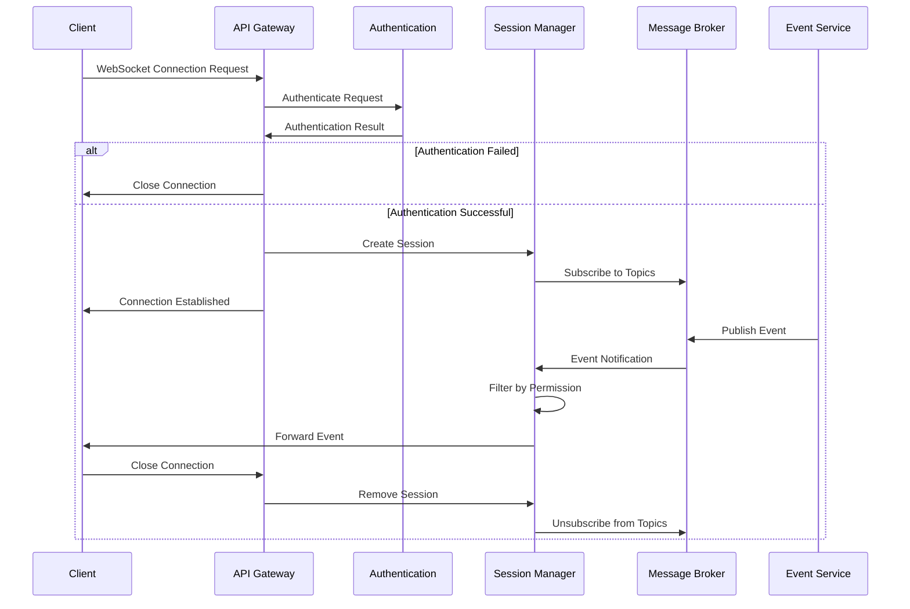
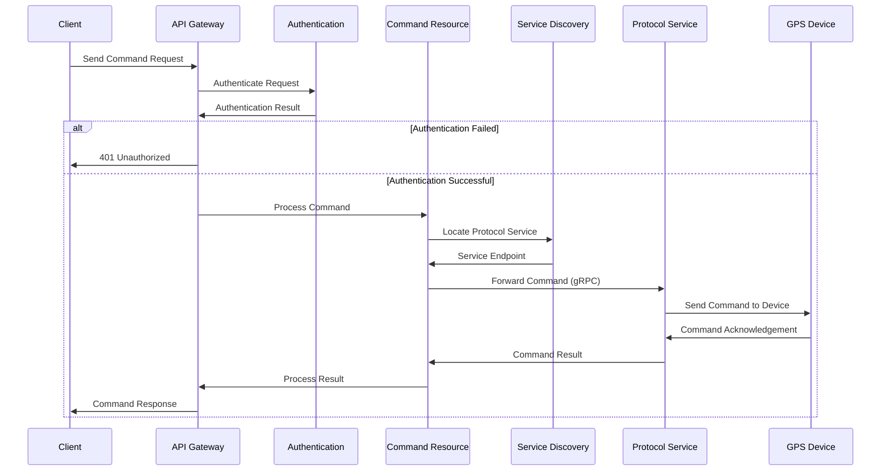

# API Gateway Architecture Overview

## 1. Introduction

The API Gateway serves as the central entry point for all client interactions with the Traccar microservices ecosystem. It acts as a facade for the underlying microservices, providing a unified interface for web and mobile clients while handling cross-cutting concerns such as authentication, request routing, and protocol translation.

This document provides a comprehensive overview of the API Gateway's architecture, its role within the microservices ecosystem, and its interaction patterns with other services.

## 2. High-Level Architecture

## 3. Key Responsibilities

The API Gateway serves as the unified entry point for all client interactions and handles several critical responsibilities:

### 3.1 Request Routing

The API Gateway routes incoming requests to the appropriate backend microservices based on the requested resource type and operation. It maintains a routing configuration that maps API endpoints to specific microservices.

### 3.2 Authentication and Authorization

The API Gateway centralizes authentication and authorization, validating user credentials and generating JWT tokens. It enforces security policies before requests reach backend services, reducing duplication of security logic across microservices.

### 3.3 Protocol Translation

The API Gateway translates between client-facing protocols (HTTP/REST, WebSocket) and internal service communication protocols (gRPC, message broker events). This allows backend services to use optimized communication methods while maintaining compatibility with standard client protocols.

### 3.4 Response Aggregation

For operations that require data from multiple microservices, the API Gateway can aggregate responses, reducing the number of round trips required by clients and presenting a unified view of the system.

### 3.5 Real-Time Updates

The API Gateway maintains WebSocket connections with clients and subscribes to relevant event streams from the message broker. It filters and forwards real-time updates to connected clients based on their permissions and subscriptions.

### 3.6 Service Discovery Integration

The API Gateway integrates with the service discovery mechanism to dynamically locate and communicate with available service instances, enabling resilient and flexible service-to-service communication.

### 3.7 Resilience Patterns

The API Gateway implements circuit breakers, retries, and timeouts to prevent cascading failures when downstream services experience issues, enhancing the overall system resilience.

## 4. Internal Component Structure

### 4.1 REST API Layer

The REST API layer is built on Jetty and Jersey (JAX-RS implementation) and includes:

- **Authentication Filter**: Validates user credentials and JWT tokens
- **CORS Filter**: Handles Cross-Origin Resource Sharing for web clients
- **Resource Classes**: JAX-RS resources that define API endpoints
- **Permission Manager**: Enforces access control based on user roles and permissions

### 4.2 WebSocket Layer

The WebSocket layer maintains real-time connections with clients and includes:

- **Session Manager**: Tracks active WebSocket connections and their associated user contexts
- **Event Forwarder**: Subscribes to message broker topics and forwards relevant events to clients
- **Permission Filter**: Ensures clients only receive events they have permission to access

### 4.3 Service Client Layer

The Service Client layer handles communication with backend microservices:

- **Service Discovery Client**: Locates available service instances using Consul or Kubernetes API
- **Load Balancer**: Distributes requests across multiple instances of the same service
- **Circuit Breaker**: Prevents cascading failures when services are unresponsive
- **Retry Handler**: Implements retry logic with exponential backoff for transient failures

### 4.4 Message Consumer Layer

The Message Consumer layer interacts with the message broker:

- **Message Consumer**: Subscribes to relevant topics on the message broker
- **Event Processor**: Processes incoming events and determines which clients should receive updates

## 5. Request Flow Diagrams

### 5.1 REST API Request Flow

### 5.2 WebSocket Connection Flow

### 5.3 Device Command Flow

## 6. Service Discovery and Routing

The API Gateway uses a dynamic service discovery mechanism to locate and communicate with backend microservices. This approach enables flexible scaling and deployment of services without hardcoding service locations.

### 6.1 Service Registration

Each microservice registers with the service discovery registry (Consul or Kubernetes) during startup, providing:

- Service identifier
- Host and port information
- Health check endpoints
- Service metadata (version, environment, etc.)

### 6.2 Service Resolution

The API Gateway resolves service locations through:

1. **DNS-Based Resolution**: Using service names as DNS entries (e.g., `position-service.default.svc.cluster.local`)
2. **API-Based Resolution**: Querying the service discovery API for available instances

### 6.3 Load Balancing

When multiple instances of a service are available, the API Gateway uses load balancing strategies:

- **Round Robin**: Distributing requests evenly across instances
- **Least Connection**: Routing to the instance with the fewest active connections
- **Response Time**: Preferring instances with lower response times

### 6.4 Health Checking

The API Gateway monitors service health through:

- **Active Health Checks**: Periodically polling service health endpoints
- **Passive Health Checks**: Monitoring for failed requests and timeouts

Unhealthy service instances are removed from the routing pool until they recover.

## 7. Authentication and Authorization

The API Gateway centralizes authentication and authorization for all client requests:

### 7.1 Authentication Methods

- **Basic Authentication**: Username/password credentials
- **JWT Tokens**: JSON Web Tokens for stateless authentication
- **API Keys**: For third-party system integration

### 7.2 Authorization Flow

1. Client request arrives at the API Gateway
2. Authentication filter validates credentials
3. User identity and roles are extracted
4. Permission manager checks access rights for the requested resource
5. If authorized, the request is forwarded to the appropriate service
6. If unauthorized, a 403 Forbidden response is returned

### 7.3 Token Management

The API Gateway handles JWT token lifecycle:

- **Token Generation**: Creating signed tokens upon successful authentication
- **Token Validation**: Verifying token signatures and expiration
- **Token Refresh**: Issuing new tokens when existing ones approach expiration

## 8. WebSocket Support

The API Gateway provides real-time updates to clients through WebSocket connections:

### 8.1 Connection Management

- **Session Tracking**: Maintaining WebSocket sessions and their associated user contexts
- **Authentication**: Validating connection requests using the same authentication mechanisms as REST API
- **Heartbeat**: Periodic ping/pong messages to detect disconnected clients

### 8.2 Event Subscription

- **Topic Subscription**: The API Gateway subscribes to relevant topics on the message broker
- **Event Filtering**: Events are filtered based on user permissions and subscriptions
- **Efficient Delivery**: Events are delivered only to clients that need them

### 8.3 Message Types

- **Position Updates**: Real-time device location changes
- **Status Changes**: Device connectivity and status updates
- **Events**: System events such as geofence transitions, alerts, etc.
- **Commands**: Device command acknowledgements and results

## 9. Resilience Patterns

The API Gateway implements several resilience patterns to maintain system stability:

### 9.1 Circuit Breakers

Circuit breakers prevent cascading failures by detecting when a service is failing and temporarily stopping requests to that service:

- **Closed State**: Normal operation, requests pass through
- **Open State**: Service is failing, requests fail fast without reaching the service
- **Half-Open State**: Testing if the service has recovered by allowing limited requests

### 9.2 Retry Mechanisms

Retry logic handles transient failures in backend services:

- **Exponential Backoff**: Increasing delay between retry attempts
- **Jitter**: Random variation in retry timing to prevent thundering herd problems
- **Maximum Retries**: Limiting the number of retry attempts before failing

### 9.3 Timeouts

Timeouts prevent requests from hanging indefinitely:

- **Connection Timeout**: Maximum time to establish a connection
- **Request Timeout**: Maximum time for a complete request/response cycle
- **Service-Specific Timeouts**: Different timeout values based on service characteristics

### 9.4 Fallback Responses

When a service is unavailable, the API Gateway can provide fallback responses:

- **Cached Data**: Returning previously cached data when available
- **Default Values**: Providing reasonable defaults when actual data cannot be retrieved
- **Graceful Degradation**: Returning partial results when complete data is unavailable

## 10. Conclusion

The API Gateway serves as a critical component in the Traccar microservices architecture, providing a unified interface for clients while handling cross-cutting concerns such as authentication, routing, and resilience. Its design enables the backend microservices to evolve independently while maintaining a consistent and reliable API for clients.

By centralizing these responsibilities, the API Gateway simplifies client integration and enhances the overall system's maintainability, scalability, and resilience.