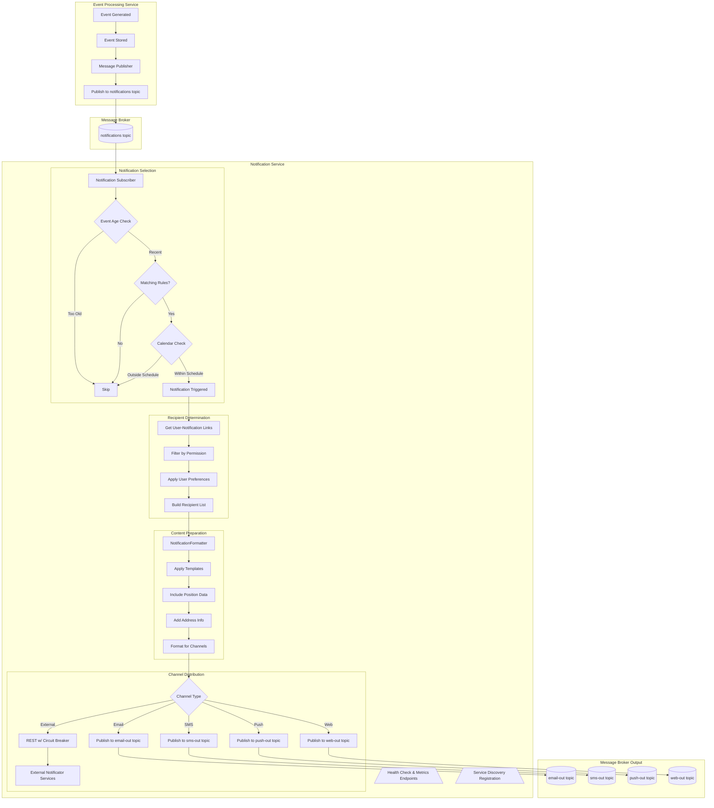
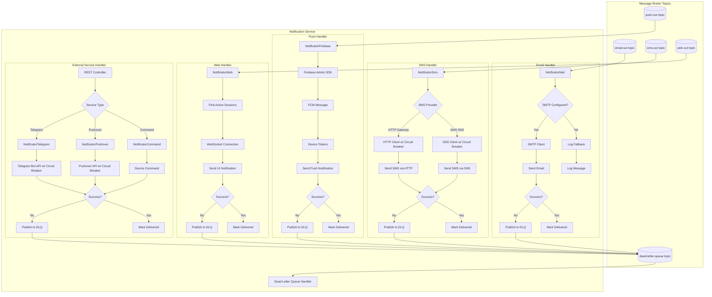
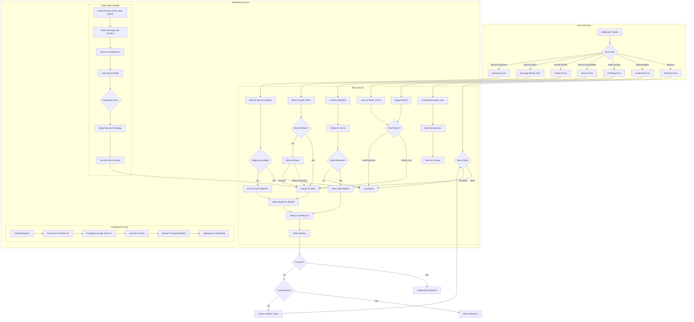

# Notification Service Architecture

## 1. Overview

The Notification Service is a critical component of the Traccar microservices architecture, responsible for managing and delivering alerts through multiple channels based on events detected in the system. This service consumes events from the message broker, applies notification rules, and delivers notifications to users through various channels including email, SMS, push notifications, web notifications, and external services like Telegram and Pushover.

The Notification Service implements a resilient, scalable architecture with comprehensive error handling and retry mechanisms to ensure reliable notification delivery even when external services experience degradation or outages.

## 2. Architecture Components

The Notification Service consists of the following key components:

### 2.1 Core Components

- **Notification Subscriber**: Consumes events from the message broker's notifications topic and initiates the notification processing pipeline.

- **Notification Selection**: Filters events based on age, matching rules, and calendar schedules to determine if a notification should be triggered.

- **Recipient Determination**: Identifies users who should receive notifications based on permissions, user-notification links, and user preferences.

- **Content Preparation**: Formats notification content using templates, includes position data, address information, and prepares content for different delivery channels.

- **Channel Distribution**: Routes notifications to appropriate delivery channels (email, SMS, push, web, external services).

- **Dead Letter Queue Handler**: Processes failed notification deliveries for retry or administrative review.

### 2.2 Supporting Components

- **Health Check & Metrics Endpoints**: Exposes service health and performance metrics for monitoring systems.

- **Service Discovery Registration**: Registers the service with the service discovery system for dynamic endpoint resolution.

- **Circuit Breakers**: Protects the service from cascading failures when external notification services are degraded.

- **Retry Service**: Implements consistent retry strategies with exponential backoff across all notification channels.

## 3. Message Flow

The notification processing follows a well-defined flow:

1. **Event Consumption**: The Event Processing Service publishes events to the "notifications" topic in the Message Broker.

2. **Notification Selection**:
   - Events are checked for age (too old events are skipped)
   - Events are matched against notification rules
   - Calendar schedules are checked to determine if notifications should be sent

3. **Recipient Determination**:
   - User-notification links are retrieved
   - Permissions are checked to filter recipients
   - User preferences are applied
   - A final recipient list is built

4. **Content Preparation**:
   - The NotificationFormatter applies templates
   - Position data is included if available
   - Address information is added
   - Content is formatted for different channels

5. **Channel Distribution**:
   - Notifications are routed to appropriate channels:
     - Email notifications are published to the email-out topic
     - SMS notifications are published to the sms-out topic
     - Push notifications are published to the push-out topic
     - Web notifications are published to the web-out topic
     - External service notifications (Telegram, Pushover, etc.) are sent via REST calls protected by circuit breakers

6. **Delivery Status Tracking**:
   - Successful deliveries are marked as delivered
   - Failed deliveries are published to the dead-letter-queue topic for retry

## 4. Notification Channels

The Notification Service supports multiple delivery channels, each implemented as a dedicated handler:

### 4.1 Email Notifications

Handled by `NotificatorMail`, which:
- Checks if SMTP is properly configured
- Uses an SMTP client to send emails
- Falls back to logging if email cannot be sent
- Publishes failed deliveries to the dead-letter queue

### 4.2 SMS Notifications

Handled by `NotificatorSms`, which:
- Supports multiple SMS providers (HTTP Gateway, AWS SNS)
- Uses circuit breakers to protect against provider outages
- Implements provider-specific error handling
- Publishes failed deliveries to the dead-letter queue

### 4.3 Push Notifications

Handled by `NotificatorFirebase`, which:
- Uses Firebase Admin SDK to send push notifications
- Manages device tokens for targeted delivery
- Implements Firebase-specific error handling
- Publishes failed deliveries to the dead-letter queue

### 4.4 Web Notifications

Handled by `NotificatorWeb`, which:
- Finds active user sessions
- Sends notifications via WebSocket connections
- Handles disconnected sessions gracefully
- Publishes failed deliveries to the dead-letter queue

### 4.5 External Service Notifications

Handled by various notificators including:
- `NotificatorTelegram`: Sends notifications via Telegram Bot API
- `NotificatorPushover`: Sends notifications via Pushover API
- `NotificatorCommand`: Sends device commands
- `NotificatorTraccar`: Sends notifications to the Traccar mobile app

All external service calls are protected by circuit breakers to prevent cascading failures.

## 5. Resilience Patterns

The Notification Service implements several resilience patterns to ensure reliable operation:

### 5.1 Circuit Breakers

All external API calls (SMS gateways, Firebase, Telegram, Pushover) are protected by circuit breakers that:
- Monitor failure rates of external service calls
- Trip open when failure thresholds are exceeded
- Prevent cascading failures by failing fast
- Automatically transition to half-open state after a configurable delay
- Allow limited test calls in half-open state to check if the underlying issue is resolved

Circuit breakers are implemented using Resilience4j with service-specific configurations.

### 5.2 Retry Mechanisms

The service implements a centralized Retry Service that:
- Applies consistent retry strategies across all notification channels
- Implements exponential backoff with jitter to prevent thundering herd problems
- Maintains correlation IDs across retry attempts for tracing
- Respects different retry policies based on error types
- Implements maximum retry limits to prevent infinite retry loops

### 5.3 Dead Letter Queue

Failed notification deliveries are published to a dead-letter queue that:
- Preserves the original notification context and correlation ID
- Enables administrative review of failed notifications
- Supports manual or automated reprocessing of failed notifications
- Provides insights into common failure patterns

### 5.4 Graceful Degradation

The service implements graceful degradation strategies:
- Prioritizes critical notifications during high load
- Falls back to alternative delivery channels when primary channels fail
- Implements notification batching and deduplication under load
- Caches templates and frequently used data to reduce external dependencies

## 6. Integration with Message Broker

The Notification Service integrates with the message broker (Kafka/RabbitMQ) for asynchronous communication:

### 6.1 Consumed Topics

- **notifications**: Events published by the Event Processing Service that may trigger notifications

### 6.2 Published Topics

- **email-out**: Email notifications for delivery
- **sms-out**: SMS notifications for delivery
- **push-out**: Push notifications for delivery
- **web-out**: Web notifications for delivery
- **dead-letter-queue**: Failed notification deliveries for retry
- **notification-status**: Delivery status updates for monitoring

### 6.3 Message Schemas

All messages use standardized schemas defined in Protocol Buffers:
- `notification.proto`: Defines the structure of notification messages
- `event.proto`: Defines the structure of event messages that trigger notifications

## 7. Service Discovery Integration

The Notification Service registers with the service discovery system (Consul/Kubernetes) to enable dynamic endpoint resolution:

### 7.1 Service Registration

During startup, the service registers with the discovery system providing:
- Service identification (name, version, instance ID)
- Endpoint information (host, port, protocol)
- Health check configuration (URL, interval, timeout)
- Service metadata (tags, environment, dependencies)

### 7.2 Health Checks

The service exposes health endpoints that report:
- Service operational status
- Dependency availability (message broker, external services)
- Resource utilization metrics
- Service-specific health indicators

### 7.3 Service Resolution

The service uses the discovery system to locate other services it needs to communicate with, such as:
- External notification services
- Monitoring and tracing services
- Administrative interfaces

## 8. Error Handling and Recovery

The Notification Service implements comprehensive error handling and recovery mechanisms:

### 8.1 Error Classification

Errors are classified into specific categories:
- **Network Errors**: Transient connectivity issues
- **Authentication Errors**: Invalid credentials for external services
- **Rate Limiting Errors**: Throttling by external services
- **Service Unavailable Errors**: External service outages
- **Invalid Format Errors**: Content formatting issues
- **Message Broker Errors**: Issues with message publishing/consuming
- **Service Discovery Errors**: Problems locating required services

### 8.2 Recovery Strategies

Different recovery strategies are applied based on error type:
- **Retry with Backoff**: For transient errors
- **Administrative Alerts**: For credential and configuration issues
- **Throttling Awareness**: Adaptive rate limiting based on provider responses
- **Service Status Checks**: Active monitoring of external service health
- **Content Validation**: Pre-delivery format checking
- **Broker Health Monitoring**: Pause and resume based on broker availability
- **Cached Endpoints**: Fallback to cached service endpoints when discovery fails

### 8.3 Correlation ID Propagation

Every notification request generates a unique correlation ID that is:
- Propagated through all services and included in logs
- Maintained across retry attempts
- Used for distributed tracing across service boundaries
- Exposed through tracing endpoints for troubleshooting

## 9. Diagrams

### 9.1 Event to Notification Process



### 9.2 Multi-Channel Notification Delivery



### 9.3 Error Handling and Retry Mechanisms



## 10. Implementation Details

### 10.1 Notificator Manager

The `NotificatorManager` class is responsible for managing different notification types and instantiating the appropriate notificator based on the notification type:

```java
@Singleton
public class NotificatorManager {

    private static final Map<String, Class<? extends Notificator>> NOTIFICATORS_ALL = Map.of(
            "command", NotificatorCommand.class,
            "web", NotificatorWeb.class,
            "mail", NotificatorMail.class,
            "sms", NotificatorSms.class,
            "firebase", NotificatorFirebase.class,
            "traccar", NotificatorTraccar.class,
            "telegram", NotificatorTelegram.class,
            "pushover", NotificatorPushover.class);

    // ... implementation details
}
```

### 10.2 Base Notificator

The `Notificator` abstract class provides the foundation for all notification channel implementations:

```java
public abstract class Notificator {

    private final NotificationFormatter notificationFormatter;
    private final String templatePath;

    public Notificator(NotificationFormatter notificationFormatter, String templatePath) {
        this.notificationFormatter = notificationFormatter;
        this.templatePath = templatePath;
    }

    public void send(Notification notification, User user, Event event, Position position) throws MessageException {
        var message = notificationFormatter.formatMessage(notification, user, event, position, templatePath);
        send(user, message, event, position);
    }

    public void send(User user, NotificationMessage message, Event event, Position position) throws MessageException {
        throw new UnsupportedOperationException();
    }
}
```

### 10.3 Notification Formatting

The `NotificationFormatter` class handles the preparation of notification content using templates and context data:

```java
@Singleton
public class NotificationFormatter {

    private final CacheManager cacheManager;
    private final TextTemplateFormatter textTemplateFormatter;

    // ... implementation details

    public NotificationMessage formatMessage(
            Notification notification, User user, Event event, Position position, String templatePath) {
        // Prepare context with server, user, device, event, position, etc.
        // Apply template formatting
        // Return formatted notification message
    }
}
```

## 11. Conclusion

The Notification Service architecture provides a robust, scalable solution for delivering notifications through multiple channels. By leveraging asynchronous messaging, circuit breakers, and comprehensive error handling, the service ensures reliable notification delivery even in the face of external service degradation or outages.

Key architectural benefits include:

- **Loose coupling** with other services through message broker integration
- **Resilience** through circuit breakers and retry mechanisms
- **Scalability** through independent processing of different notification channels
- **Observability** through health checks, metrics, and distributed tracing
- **Flexibility** to add new notification channels without modifying existing code

This architecture supports the Traccar platform's mission-critical notification requirements while providing a foundation for future enhancements and additional notification channels.