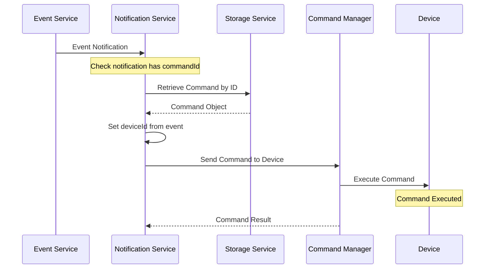

# Command Notification Channel

## Overview

The Command Notification Channel enables the Notification Service to trigger device commands automatically in response to events. This powerful feature allows for automated device control based on event conditions, creating a closed-loop system for device management and response.

## How It Works

When an event occurs that matches a notification rule with the command channel configured, the Notification Service will execute a predefined command on the target device. This process integrates the notification system with the device command subsystem to provide automated device control capabilities.

## Configuration

### Notification Setup

To use the command notification channel:

1. Create a command template in the system with the desired parameters
2. Configure a notification rule that uses the command channel
3. Associate the pre-configured command with the notification by setting the `commandId`

### Command Configuration

Commands must be pre-configured in the system before they can be used with notifications. Each command includes:

- **Command Type**: The specific command to execute (e.g., positionSingle, engineStop)
- **Command Attributes**: Any parameters required by the command
- **Description**: A human-readable description of the command's purpose

### Device Targeting

The command will be sent to the device that triggered the event. The Notification Service automatically sets the target device ID based on the `deviceId` from the event that triggered the notification.

## Command Execution Flow

1. An event is detected and sent to the Notification Service
2. The Notification Service determines that a command notification is configured
3. The service verifies that a valid `commandId` is provided in the notification configuration
4. The command object is retrieved from storage using the `commandId`
5. The device ID from the event is set on the command
6. The command is sent to the device via the CommandsManager
7. The device receives and executes the command

## Integration with Device Command Subsystem

The Command Notification Channel integrates with the device command subsystem through the CommandsManager. This component:

- Handles the protocol-specific formatting of commands
- Manages the delivery of commands to devices
- Tracks command status and execution results
- Provides error handling and retry capabilities

The NotificatorCommand class serves as the bridge between the notification system and the command subsystem, ensuring that commands triggered by notifications are properly formatted and delivered to the target devices.

## Error Handling

The Command Notification Channel includes several error handling mechanisms:

- **Validation Checks**: Ensures that notifications have a valid commandId before attempting execution
- **Exception Handling**: Captures and reports any errors during command retrieval or execution
- **Logging**: Records command execution attempts and results for troubleshooting

If a command cannot be executed, the error is captured and returned as a MessageException, which is then handled by the notification system's error handling framework.

## Troubleshooting

### Common Issues

| Issue | Possible Causes | Resolution |
|-------|----------------|------------|
| Command not executed | Missing or invalid commandId | Verify the notification has a valid commandId configured |
| Command not executed | Device offline | Ensure the device is online and able to receive commands |
| Command not executed | Command not supported by device | Verify the device supports the command type |
| Command execution failed | Incorrect command parameters | Check the command configuration for proper parameters |
| Permission denied | User lacks permission to execute command | Verify the user has appropriate permissions for the command |

### Debugging Steps

1. **Check Notification Configuration**: Verify that the notification has a valid commandId configured
2. **Verify Command Exists**: Ensure the command referenced by commandId exists in the system
3. **Check Device Status**: Confirm the target device is online and able to receive commands
4. **Review Logs**: Check the notification service logs for any errors during command execution
5. **Test Direct Command**: Try sending the command directly to the device to verify it works outside the notification system

## Security Considerations

The Command Notification Channel has important security implications since it can trigger actions on physical devices. Consider the following security aspects:

- **Permission Control**: Ensure that notification rules with commands are only created by authorized users
- **Command Limitations**: Restrict dangerous commands from being used in automated notifications
- **Audit Logging**: All command executions triggered by notifications are logged for audit purposes

## Use Cases

### Automated Response

Use command notifications to automatically respond to events, such as:

- Stopping a vehicle when an unauthorized movement event is detected
- Requesting additional position updates when a device enters a geofence
- Locking a device when a tamper event is detected

### Scheduled Actions

Combine command notifications with scheduled events to perform regular actions:

- Daily device restart at a specific time
- Regular diagnostic command execution
- Scheduled mode changes based on time patterns

## Best Practices

1. **Test thoroughly**: Always test command notifications in a controlled environment before deploying to production
2. **Use descriptive names**: Give commands clear names that indicate their purpose when used in notifications
3. **Monitor execution**: Implement monitoring to track successful and failed command executions
4. **Limit automatic commands**: Be selective about which commands are triggered automatically to prevent unintended consequences
5. **Document configurations**: Maintain documentation of all command notifications for operational awareness