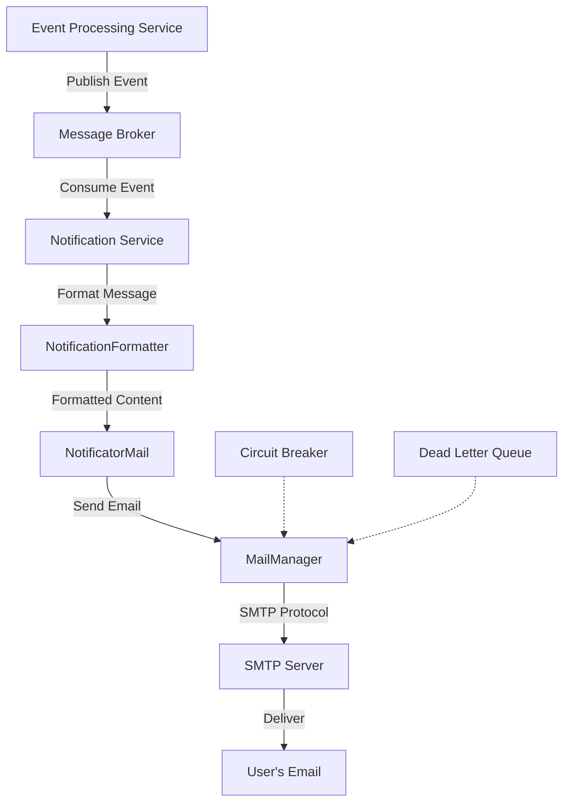

# Email Notification Channel

## Overview

The Email Notification Channel is a core component of the Traccar Notification Service that enables the system to send email alerts for various tracking events. This channel leverages the Jakarta Mail API to deliver notifications to users via SMTP servers.

Within the microservices architecture, the Email Notification Channel operates as part of the Notification Service, which receives events from the Event Processing Service via the message broker. When an event that requires email notification is detected, the Notification Service formats the message using templates and delivers it through the configured SMTP server.

## Architecture

The Email Notification Channel is implemented by the `NotificatorMail` class, which:

- Extends the base `Notificator` class
- Uses dependency injection to receive a `MailManager` instance
- Formats notification content using the `NotificationFormatter`
- Sends emails through the configured SMTP server



## SMTP Configuration

The Email Notification Channel requires proper SMTP configuration to function correctly. Configuration is managed through the Notification Service's configuration file or environment variables.

### Basic Configuration

```yaml
mail:
  smtp.host: smtp.example.com      # SMTP server hostname
  smtp.port: 587                   # SMTP server port (typically 25, 465, or 587)
  smtp.starttls.enable: true       # Enable STARTTLS for secure connection
  smtp.ssl.enable: false           # Enable SSL (usually not used with STARTTLS)
  smtp.username: user@example.com  # SMTP authentication username
  smtp.password: password          # SMTP authentication password
  smtp.from: traccar@example.com   # From email address
  smtp.from.name: Traccar System   # From name displayed to recipients
```

### Advanced Configuration

```yaml
mail:
  # Connection settings
  smtp.connectiontimeout: 30000    # Connection timeout in milliseconds
  smtp.timeout: 30000              # Socket I/O timeout in milliseconds
  smtp.writetimeout: 30000         # Socket write timeout in milliseconds
  
  # Authentication settings
  smtp.auth: true                  # Enable SMTP authentication
  smtp.auth.mechanisms: LOGIN      # Authentication mechanisms (LOGIN, PLAIN, DIGEST-MD5, etc.)
  
  # TLS/SSL settings
  smtp.starttls.required: false    # Require STARTTLS (fail if not available)
  smtp.ssl.trust: smtp.example.com # Trust specific hosts without certificate verification
  smtp.ssl.protocols: TLSv1.2      # Specify TLS protocols to use
  
  # Proxy settings (if required)
  smtp.proxy.host: proxy.example.com # Proxy server hostname
  smtp.proxy.port: 8080             # Proxy server port
  
  # Debug settings
  smtp.debug: false                # Enable debug output for troubleshooting
```

### Environment Variable Configuration

In containerized environments, configuration can be provided through environment variables:

```bash
TRACCAR_MAIL_SMTP_HOST=smtp.example.com
TRACCAR_MAIL_SMTP_PORT=587
TRACCAR_MAIL_SMTP_STARTTLS_ENABLE=true
TRACCAR_MAIL_SMTP_USERNAME=user@example.com
TRACCAR_MAIL_SMTP_PASSWORD=password
TRACCAR_MAIL_SMTP_FROM=traccar@example.com
TRACCAR_MAIL_SMTP_FROM_NAME=Traccar System
```

## Email Template Customization

The Email Notification Channel uses templates to format notification messages. Templates can be customized to match your organization's branding and communication style.

### Template Location

Email templates are stored in the `notification-service/src/main/resources/templates` directory and are loaded at runtime. The default template format is Velocity Template Language (VTL).

### Template Variables

The following variables are available in email templates:

| Variable | Description |
| --- | --- |
| `${device}` | Device object with properties like name, uniqueId, etc. |
| `${event}` | Event object with properties like type, serverTime, etc. |
| `${position}` | Position object with location data (if available) |
| `${user}` | User object with properties like name, email, etc. |
| `${webUrl}` | URL to the web interface |
| `${appUrl}` | URL to the mobile app |
| `${geocoder}` | Address information based on position coordinates |
| `${speedUnit}` | User's preferred speed unit (km/h, mph, etc.) |
| `${distanceUnit}` | User's preferred distance unit (km, mi, etc.) |
| `${timezone}` | User's timezone for date/time formatting |

### Example Template

```html
<!DOCTYPE html>
<html>
<head>
  <title>${event.type} Notification</title>
</head>
<body>
  <h1>${event.type} Alert</h1>
  <p>Device: ${device.name}</p>
  <p>Time: ${event.serverTime}</p>
  #if($position)
  <p>Location: ${geocoder}</p>
  <p>Speed: ${position.speed} ${speedUnit}</p>
  <p>View on map: <a href="${webUrl}?deviceId=${device.id}&from=${event.serverTime.time-3600000}&to=${event.serverTime.time+3600000}">${webUrl}</a></p>
  #end
</body>
</html>
```

### Custom Templates

To create custom templates:

1. Create a new template file in the templates directory
2. Configure the template mapping in the notification service configuration
3. Restart the Notification Service to apply changes

## Error Handling and Retry Mechanisms

The Email Notification Channel implements robust error handling and retry mechanisms to ensure reliable message delivery.

### Error Handling

When an email fails to send, the following process occurs:

1. The `NotificatorMail` catches `MessagingException` and wraps it in a `MessageException`
2. The exception is logged with detailed information about the failure
3. The notification is marked as failed in the system
4. Depending on the error type, the system may attempt to retry delivery

### Retry Policy

The Notification Service implements a configurable retry policy for failed notifications:

```yaml
resilience4j:
  retry:
    instances:
      emailNotification:
        maxAttempts: 3                  # Maximum number of retry attempts
        waitDuration: 5s                # Initial wait time between retries
        enableExponentialBackoff: true  # Increase wait time exponentially
        exponentialBackoffMultiplier: 2 # Multiplier for backoff calculation
        retryExceptions:                # Exceptions that trigger retry
          - jakarta.mail.MessagingException
          - java.net.ConnectException
          - java.io.IOException
```

### Dead Letter Queue

If a notification fails after all retry attempts, it is sent to a Dead Letter Queue (DLQ) for later processing:

1. The failed notification is published to the `notification-dlq` topic in the message broker
2. The Dead Letter Queue Handler periodically processes these messages
3. Administrators can view and manually retry failed notifications through the management interface

## Troubleshooting

### Common Issues

#### Connection Failures

**Symptoms:**
- Error logs showing "Connection refused" or "Connection timeout"
- No emails being delivered

**Solutions:**
- Verify SMTP server hostname and port are correct
- Check network connectivity between Notification Service and SMTP server
- Ensure firewall rules allow outbound connections to the SMTP port

#### Authentication Failures

**Symptoms:**
- Error logs showing "Authentication failed" or "Invalid credentials"
- Emails failing to send with 5xx error codes

**Solutions:**
- Verify username and password are correct
- Check if the SMTP server requires specific authentication mechanisms
- For Gmail or other providers with enhanced security, create an app-specific password

#### TLS/SSL Issues

**Symptoms:**
- Error logs showing "Could not convert socket to TLS" or certificate errors
- Connection failures during TLS handshake

**Solutions:**
- Ensure `smtp.starttls.enable` or `smtp.ssl.enable` is properly configured
- Check if the SMTP server's certificate is valid and trusted
- Configure `smtp.ssl.trust` if using a self-signed certificate

#### Rate Limiting

**Symptoms:**
- Emails work initially but fail after sending several messages
- Error logs showing "421 Too many messages" or similar

**Solutions:**
- Implement rate limiting in your configuration
- Consider using a professional email service with higher sending limits
- Spread sending across multiple SMTP servers if necessary

### Debugging

To enable detailed SMTP debugging:

1. Set `smtp.debug: true` in your configuration
2. Check logs for detailed SMTP communication
3. Look for specific error codes and messages from the SMTP server

### Monitoring

The Notification Service exposes metrics for monitoring email notification performance:

- `notification.email.sent`: Counter of successfully sent emails
- `notification.email.failed`: Counter of failed email attempts
- `notification.email.retry`: Counter of retry attempts
- `notification.email.latency`: Timer measuring email sending duration

These metrics can be collected by Prometheus and visualized in Grafana dashboards to monitor the health of the Email Notification Channel.

## References

- [Jakarta Mail API Documentation](https://jakarta.ee/specifications/mail/)
- [SMTP Protocol RFC 5321](https://tools.ietf.org/html/rfc5321)
- [Velocity Template Language Guide](https://velocity.apache.org/engine/devel/user-guide.html)
- [Resilience4j Documentation](https://resilience4j.readme.io/docs)