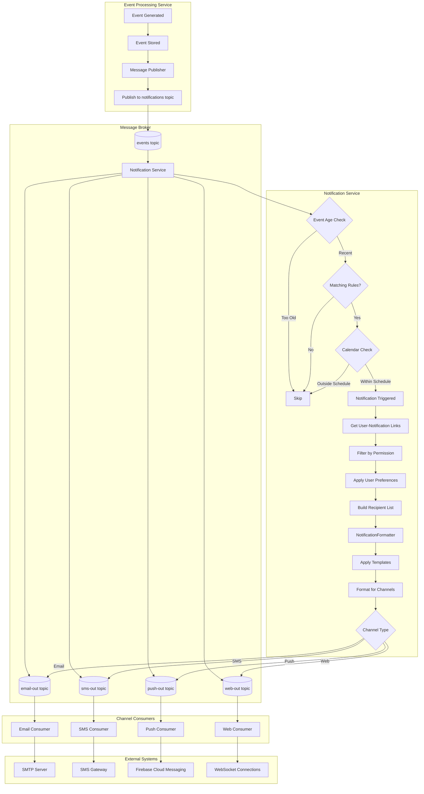

# Notification Service Integration Guide

## Table of Contents

1. [Introduction](#introduction)
2. [Architecture Overview](#architecture-overview)
3. [Integration Methods](#integration-methods)
   - [Event Publishing](#event-publishing)
   - [Notification Status Subscription](#notification-status-subscription)
   - [Custom Notification Channels](#custom-notification-channels)
4. [Common Integration Scenarios](#common-integration-scenarios)
   - [Publishing Events from Microservices](#publishing-events-from-microservices)
   - [Subscribing to Notification Status](#subscribing-to-notification-status)
   - [Implementing a Custom Notificator](#implementing-a-custom-notificator)
5. [Configuration Reference](#configuration-reference)
6. [Troubleshooting](#troubleshooting)
7. [Best Practices](#best-practices)
8. [API Reference](#api-reference)

## Introduction

The Notification Service is responsible for delivering alerts through multiple channels (email, SMS, push notifications, web, etc.) based on events detected within the Traccar system. This guide explains how to integrate with the Notification Service from other microservices and external systems.

The service follows an event-driven architecture, consuming events from a message broker and publishing notification status updates back to the broker. This asynchronous communication pattern enables loose coupling between services and ensures reliable notification delivery.

## Architecture Overview

The Notification Service architecture consists of the following key components:

- **Event Message Consumer**: Processes incoming events from the message broker and determines which notifications to trigger
- **Channel-Specific Consumers**: Dedicated consumers for each notification channel (email, SMS, push, web)
- **Dead Letter Queue Consumer**: Handles failed notification delivery attempts with retry logic
- **Notification Formatters**: Format notification content for different channels
- **Notification Providers**: Channel-specific implementations for delivering notifications



## Integration Methods

### Event Publishing

To trigger notifications, microservices publish events to the message broker. The Notification Service consumes these events and processes them according to configured notification rules.

#### Event Message Format

Events should follow this structure when published to the broker:

```json
{
  "type": "deviceOffline",
  "eventTime": "2023-06-01T12:34:56.789Z",
  "deviceId": 123,
  "positionId": 456,
  "geofenceId": null,
  "maintenanceId": null,
  "attributes": {
    "alarm": "disconnected"
  },
  "correlationId": "550e8400-e29b-41d4-a716-446655440000"
}
```

Required fields:
- `type`: Event type identifier (e.g., "deviceOffline", "geofenceEnter", "overspeed")
- `eventTime`: ISO-8601 formatted timestamp when the event occurred
- `deviceId`: Identifier of the device associated with the event
- `correlationId`: Unique identifier for tracing the event through the system

Optional fields:
- `positionId`: Identifier of the position associated with the event (if applicable)
- `geofenceId`: Identifier of the geofence associated with the event (if applicable)
- `maintenanceId`: Identifier of the maintenance associated with the event (if applicable)
- `attributes`: Additional event-specific attributes as key-value pairs

#### Publishing Events Using Kafka

```java
@Service
public class EventPublisher {
    private final KafkaTemplate<String, EventMessage> kafkaTemplate;
    private final String eventTopic;
    
    public EventPublisher(KafkaTemplate<String, EventMessage> kafkaTemplate,
                         @Value("${kafka.topics.events}") String eventTopic) {
        this.kafkaTemplate = kafkaTemplate;
        this.eventTopic = eventTopic;
    }
    
    public void publishEvent(EventMessage event) {
        // Set a correlation ID if not already present
        if (event.getCorrelationId() == null) {
            event.setCorrelationId(UUID.randomUUID().toString());
        }
        
        // Use deviceId as the message key for partitioning
        String key = String.valueOf(event.getDeviceId());
        
        kafkaTemplate.send(eventTopic, key, event)
            .addCallback(
                result -> log.debug("Event published successfully: {}", event.getCorrelationId()),
                ex -> log.error("Failed to publish event: {}", event.getCorrelationId(), ex)
            );
    }
}
```

#### Publishing Events Using RabbitMQ

```java
@Service
public class EventPublisher {
    private final RabbitTemplate rabbitTemplate;
    private final String eventExchange;
    private final String eventRoutingKey;
    
    public EventPublisher(RabbitTemplate rabbitTemplate,
                         @Value("${rabbitmq.exchanges.events}") String eventExchange,
                         @Value("${rabbitmq.routing-keys.events}") String eventRoutingKey) {
        this.rabbitTemplate = rabbitTemplate;
        this.eventExchange = eventExchange;
        this.eventRoutingKey = eventRoutingKey;
    }
    
    public void publishEvent(EventMessage event) {
        // Set a correlation ID if not already present
        if (event.getCorrelationId() == null) {
            event.setCorrelationId(UUID.randomUUID().toString());
        }
        
        rabbitTemplate.convertAndSend(eventExchange, eventRoutingKey, event, message -> {
            MessageProperties props = message.getMessageProperties();
            props.setCorrelationId(event.getCorrelationId());
            props.setHeader("deviceId", event.getDeviceId());
            return message;
        });
    }
}
```

### Notification Status Subscription

Microservices can subscribe to notification status updates to track delivery success or failure. The Notification Service publishes status updates to dedicated topics in the message broker.

#### Status Message Format

```json
{
  "notificationId": "550e8400-e29b-41d4-a716-446655440000",
  "eventId": "123e4567-e89b-12d3-a456-426614174000",
  "userId": 789,
  "deviceId": 123,
  "channel": "email",
  "status": "delivered",
  "timestamp": "2023-06-01T12:35:42.123Z",
  "errorMessage": null,
  "retryCount": 0,
  "correlationId": "550e8400-e29b-41d4-a716-446655440000"
}
```

Fields:
- `notificationId`: Unique identifier for the notification
- `eventId`: Identifier of the event that triggered the notification
- `userId`: Identifier of the user who received the notification
- `deviceId`: Identifier of the device associated with the notification
- `channel`: Notification channel ("email", "sms", "push", "web", etc.)
- `status`: Delivery status ("delivered", "failed", "pending", "retrying")
- `timestamp`: ISO-8601 formatted timestamp of the status update
- `errorMessage`: Error message if delivery failed (null for successful delivery)
- `retryCount`: Number of retry attempts (0 for first attempt)
- `correlationId`: Correlation ID for tracing (matches the original event)

#### Subscribing to Status Updates Using Kafka

```java
@Service
public class NotificationStatusConsumer {
    @KafkaListener(
        topics = "${kafka.topics.notification-status}",
        groupId = "${kafka.consumer.group-id}",
        containerFactory = "kafkaListenerContainerFactory"
    )
    public void consumeNotificationStatus(NotificationStatusMessage status) {
        log.info("Received notification status: {} for user {} via {}", 
                status.getStatus(), status.getUserId(), status.getChannel());
        
        // Process the status update
        if ("delivered".equals(status.getStatus())) {
            // Handle successful delivery
        } else if ("failed".equals(status.getStatus())) {
            // Handle delivery failure
        }
    }
}
```

#### Subscribing to Status Updates Using RabbitMQ

```java
@Service
public class NotificationStatusConsumer {
    @RabbitListener(
        queues = "${rabbitmq.queues.notification-status}"
    )
    public void consumeNotificationStatus(NotificationStatusMessage status) {
        log.info("Received notification status: {} for user {} via {}", 
                status.getStatus(), status.getUserId(), status.getChannel());
        
        // Process the status update
        if ("delivered".equals(status.getStatus())) {
            // Handle successful delivery
        } else if ("failed".equals(status.getStatus())) {
            // Handle delivery failure
        }
    }
}
```

### Custom Notification Channels

The Notification Service supports extending its functionality with custom notification channels. This is useful for integrating with third-party notification services or implementing organization-specific notification methods.

#### Implementing a Custom Notificator

To create a custom notification channel, implement the `Notificator` interface:

```java
public class CustomNotificator implements Notificator {
    private final Logger logger = LoggerFactory.getLogger(CustomNotificator.class);
    private final Config config;
    
    @Inject
    public CustomNotificator(Config config) {
        this.config = config;
    }
    
    @Override
    public void sendAsync(long userId, Event event, Position position) {
        // Implement your custom notification logic here
        try {
            // Example: Send notification to a custom API
            String apiUrl = config.getString("notificator.custom.url");
            String apiKey = config.getString("notificator.custom.key");
            
            // Create notification payload
            Map<String, Object> payload = new HashMap<>();
            payload.put("userId", userId);
            payload.put("eventType", event.getType());
            payload.put("deviceId", event.getDeviceId());
            payload.put("timestamp", event.getEventTime());
            
            if (position != null) {
                payload.put("latitude", position.getLatitude());
                payload.put("longitude", position.getLongitude());
                payload.put("speed", position.getSpeed());
            }
            
            // Send to custom API
            // ... implementation details ...
            
            logger.info("Custom notification sent for user: {} and event: {}", userId, event.getType());
        } catch (Exception e) {
            logger.warn("Failed to send custom notification", e);
        }
    }
}
```

#### Registering a Custom Notificator

To register your custom notificator with the Notification Service, you need to:

1. Add your notificator class to the `NOTIFICATORS_ALL` map in `NotificatorManager`:

```java
private static final Map<String, Class<? extends Notificator>> NOTIFICATORS_ALL = Map.of(
        "command", NotificatorCommand.class,
        "web", NotificatorWeb.class,
        "mail", NotificatorMail.class,
        "sms", NotificatorSms.class,
        "firebase", NotificatorFirebase.class,
        "traccar", NotificatorTraccar.class,
        "telegram", NotificatorTelegram.class,
        "pushover", NotificatorPushover.class,
        "custom", CustomNotificator.class);
```

2. Enable your notificator in the configuration by adding it to the `notificator.types` property:

```properties
notificator.types=mail,sms,web,firebase,custom
```

## Common Integration Scenarios

### Publishing Events from Microservices

This example shows how to publish an event from the Position Service when a device enters a geofence:

```java
@Service
public class GeofenceEventGenerator {
    private final EventPublisher eventPublisher;
    
    @Inject
    public GeofenceEventGenerator(EventPublisher eventPublisher) {
        this.eventPublisher = eventPublisher;
    }
    
    public void checkGeofenceEnter(Position position, Geofence geofence) {
        if (isGeofenceEnter(position, geofence)) {
            // Create geofence enter event
            EventMessage event = new EventMessage();
            event.setType("geofenceEnter");
            event.setEventTime(position.getDeviceTime());
            event.setDeviceId(position.getDeviceId());
            event.setPositionId(position.getId());
            event.setGeofenceId(geofence.getId());
            
            // Add additional attributes
            Map<String, Object> attributes = new HashMap<>();
            attributes.put("geofenceName", geofence.getName());
            event.setAttributes(attributes);
            
            // Generate correlation ID
            event.setCorrelationId(UUID.randomUUID().toString());
            
            // Publish the event
            eventPublisher.publishEvent(event);
        }
    }
    
    private boolean isGeofenceEnter(Position position, Geofence geofence) {
        // Implementation of geofence enter detection
        // ...
    }
}
```

### Subscribing to Notification Status

This example shows how to subscribe to notification status updates in the API Gateway Service to provide real-time feedback to clients:

```java
@Service
public class NotificationStatusTracker {
    private final Map<String, NotificationStatusMessage> statusCache = new ConcurrentHashMap<>();
    private final SimpMessagingTemplate websocketTemplate;
    
    @Inject
    public NotificationStatusTracker(SimpMessagingTemplate websocketTemplate) {
        this.websocketTemplate = websocketTemplate;
    }
    
    @KafkaListener(
        topics = "${kafka.topics.notification-status}",
        groupId = "${kafka.consumer.group-id}"
    )
    public void consumeNotificationStatus(NotificationStatusMessage status) {
        // Store the latest status in cache
        statusCache.put(status.getNotificationId(), status);
        
        // Forward status to connected WebSocket clients
        String destination = "/topic/notifications/" + status.getUserId();
        websocketTemplate.convertAndSend(destination, status);
        
        // Clean up old statuses (optional)
        cleanupOldStatuses();
    }
    
    public NotificationStatusMessage getStatus(String notificationId) {
        return statusCache.get(notificationId);
    }
    
    private void cleanupOldStatuses() {
        // Remove statuses older than 24 hours
        // ...
    }
}
```

### Implementing a Custom Notificator

This example shows how to implement a custom notificator that sends notifications to Microsoft Teams:

```java
public class TeamsNotificator implements Notificator {
    private final Logger logger = LoggerFactory.getLogger(TeamsNotificator.class);
    private final Config config;
    private final NotificationFormatter formatter;
    private final WebClient webClient;
    
    @Inject
    public TeamsNotificator(Config config, NotificationFormatter formatter) {
        this.config = config;
        this.formatter = formatter;
        this.webClient = WebClient.builder()
            .baseUrl(config.getString("notificator.teams.webhook"))
            .defaultHeader(HttpHeaders.CONTENT_TYPE, MediaType.APPLICATION_JSON_VALUE)
            .build();
    }
    
    @Override
    public void sendAsync(long userId, Event event, Position position) {
        try {
            // Format notification message
            String message = formatter.formatMessage(userId, event, position);
            
            // Create Teams message payload
            Map<String, Object> payload = new HashMap<>();
            payload.put("@type", "MessageCard");
            payload.put("@context", "http://schema.org/extensions");
            payload.put("themeColor", "0076D7");
            payload.put("summary", "Traccar Notification");
            
            Map<String, String> section = new HashMap<>();
            section.put("activityTitle", "Traccar Alert: " + event.getType());
            section.put("activitySubtitle", "Device ID: " + event.getDeviceId());
            section.put("activityText", message);
            
            payload.put("sections", Collections.singletonList(section));
            
            // Send to Teams webhook
            webClient.post()
                .bodyValue(payload)
                .retrieve()
                .toBodilessEntity()
                .subscribe(
                    response -> logger.info("Teams notification sent successfully"),
                    error -> logger.error("Failed to send Teams notification", error)
                );
            
        } catch (Exception e) {
            logger.warn("Failed to send Teams notification", e);
        }
    }
}
```

## Configuration Reference

### Notification Service Configuration

```yaml
# Notification Service Configuration
notificator:
  types: mail,sms,web,firebase,telegram,pushover  # Enabled notification channels
  
  # Email configuration
  mail:
    smtp.host: smtp.example.com
    smtp.port: 587
    smtp.starttls.enable: true
    smtp.username: user@example.com
    smtp.password: password
    smtp.from: traccar@example.com
    
  # SMS configuration
  sms:
    provider: http  # Options: http, aws
    http.url: https://api.example.com/sms
    http.authorization: Bearer token
    aws.region: us-east-1
    aws.accessKey: your-access-key
    aws.secretKey: your-secret-key
    
  # Firebase configuration
  firebase:
    serviceAccountPath: /path/to/firebase-credentials.json
    databaseUrl: https://your-project.firebaseio.com
    
  # Telegram configuration
  telegram:
    botToken: your-telegram-bot-token
    chatId: default-chat-id
    
  # Pushover configuration
  pushover:
    userKey: your-pushover-user-key
    appKey: your-pushover-app-key

# Message broker configuration (Kafka example)
kafka:
  bootstrap-servers: kafka:9092
  topics:
    events: traccar.events
    notification-status: traccar.notification.status
    email-out: traccar.notification.email
    sms-out: traccar.notification.sms
    push-out: traccar.notification.push
    web-out: traccar.notification.web
    dead-letter-queue: traccar.notification.dlq
  consumer:
    group-id: notification-service
    auto-offset-reset: earliest
    enable-auto-commit: false
    max-poll-records: 500

# Message broker configuration (RabbitMQ example)
rabbitmq:
  host: rabbitmq
  port: 5672
  username: guest
  password: guest
  virtual-host: /
  exchanges:
    events: traccar.events
    notifications: traccar.notifications
  queues:
    events: traccar.events.notification-service
    notification-status: traccar.notification.status
    email-out: traccar.notification.email
    sms-out: traccar.notification.sms
    push-out: traccar.notification.push
    web-out: traccar.notification.web
    dead-letter-queue: traccar.notification.dlq
  routing-keys:
    events: events.#
    notification-status: notification.status
    email-out: notification.email
    sms-out: notification.sms
    push-out: notification.push
    web-out: notification.web
    dead-letter-queue: notification.dlq
```

## Troubleshooting

### Common Issues

#### Events Not Triggering Notifications

1. **Check Event Format**: Ensure the event message includes all required fields (type, eventTime, deviceId, correlationId).
2. **Verify Topic Configuration**: Confirm that the event is being published to the correct topic.
3. **Check Notification Rules**: Verify that notification rules are configured for the event type.
4. **Inspect Consumer Logs**: Check the Notification Service logs for any errors in event processing.
5. **Monitor Consumer Group**: Ensure the consumer group is properly consuming messages from the topic.

#### Failed Notification Delivery

1. **Check Channel Configuration**: Verify the configuration for the specific notification channel (SMTP settings, API keys, etc.).
2. **Inspect Dead Letter Queue**: Check the dead-letter-queue topic for failed notification messages.
3. **Review Error Messages**: Examine the error messages in the notification status updates.
4. **Check External Services**: Verify that external services (SMTP server, SMS gateway, etc.) are operational.
5. **Monitor Retry Attempts**: Check if notifications are being retried and whether they eventually succeed.

### Debugging Tools

1. **Correlation IDs**: Use correlation IDs to trace events through the system.
2. **Message Broker UI**: Use Kafka UI or RabbitMQ Management Console to inspect topics, queues, and messages.
3. **Service Logs**: Check the Notification Service logs for detailed information about event processing and notification delivery.
4. **Health Endpoints**: Use the service's health endpoints to check the status of dependencies.
5. **Metrics**: Monitor service metrics for insight into message processing rates, error rates, and latency.

## Best Practices

### Event Publishing

1. **Include Correlation IDs**: Always include a correlation ID in event messages for tracing.
2. **Use Consistent Event Types**: Standardize event type names across all services.
3. **Include Relevant Context**: Add all relevant information to the event message to avoid additional lookups.
4. **Handle Publish Failures**: Implement proper error handling for event publishing failures.
5. **Consider Partitioning**: Use appropriate keys for message partitioning to maintain order when needed.

### Notification Configuration

1. **Secure Credentials**: Store sensitive credentials (SMTP passwords, API keys) securely.
2. **Test Notification Channels**: Regularly test all notification channels to ensure they're working.
3. **Configure Rate Limits**: Set appropriate rate limits to prevent overwhelming notification channels.
4. **Implement Fallbacks**: Configure fallback notification channels for critical alerts.
5. **Monitor Delivery Rates**: Track notification delivery success rates and investigate drops.

### Custom Notificators

1. **Implement Circuit Breakers**: Use circuit breakers to prevent cascading failures when external services are unavailable.
2. **Handle Errors Gracefully**: Catch and log exceptions without disrupting the notification pipeline.
3. **Respect Rate Limits**: Implement rate limiting to comply with external service constraints.
4. **Add Comprehensive Logging**: Include detailed logging for troubleshooting.
5. **Consider Async Processing**: Use asynchronous processing for external API calls to avoid blocking.

## API Reference

### REST API Endpoints

The Notification Service exposes the following REST API endpoints for direct integration:

#### Notification Status

```
GET /api/v1/notifications/status/{notificationId}
```

Retrieve the status of a specific notification.

**Response:**
```json
{
  "notificationId": "550e8400-e29b-41d4-a716-446655440000",
  "eventId": "123e4567-e89b-12d3-a456-426614174000",
  "userId": 789,
  "deviceId": 123,
  "channel": "email",
  "status": "delivered",
  "timestamp": "2023-06-01T12:35:42.123Z",
  "errorMessage": null,
  "retryCount": 0
}
```

#### Send Notification

```
POST /api/v1/notifications/send
```

Send a notification directly (bypassing the event system).

**Request Body:**
```json
{
  "userId": 789,
  "deviceId": 123,
  "title": "Alert: Device Offline",
  "message": "Your device 'Truck 42' has gone offline.",
  "channels": ["email", "sms"],
  "priority": "high",
  "attributes": {
    "deviceName": "Truck 42",
    "lastSeen": "2023-06-01T12:30:00Z"
  }
}
```

**Response:**
```json
{
  "notificationId": "550e8400-e29b-41d4-a716-446655440000",
  "status": "pending"
}
```

#### Notification Templates

```
GET /api/v1/notifications/templates
```

Retrieve available notification templates.

**Response:**
```json
[
  {
    "id": "deviceOffline",
    "title": "Device Offline Template",
    "channels": ["email", "sms", "push"],
    "description": "Template for device offline notifications"
  },
  {
    "id": "geofenceEnter",
    "title": "Geofence Enter Template",
    "channels": ["email", "sms", "push"],
    "description": "Template for geofence enter notifications"
  }
]
```

### gRPC Service

The Notification Service also provides a gRPC interface for high-performance integration:

```protobuf
syntax = "proto3";

package org.traccar.notification;

service NotificationService {
  // Send a notification directly
  rpc SendNotification(NotificationRequest) returns (NotificationResponse);
  
  // Get notification status
  rpc GetNotificationStatus(StatusRequest) returns (StatusResponse);
  
  // Stream notification status updates
  rpc StreamNotificationStatus(StatusStreamRequest) returns (stream StatusResponse);
}

message NotificationRequest {
  int64 user_id = 1;
  int64 device_id = 2;
  string title = 3;
  string message = 4;
  repeated string channels = 5;
  string priority = 6;
  map<string, string> attributes = 7;
}

message NotificationResponse {
  string notification_id = 1;
  string status = 2;
}

message StatusRequest {
  string notification_id = 1;
}

message StatusStreamRequest {
  int64 user_id = 1;
  int64 device_id = 2;
  repeated string channels = 3;
}

message StatusResponse {
  string notification_id = 1;
  string event_id = 2;
  int64 user_id = 3;
  int64 device_id = 4;
  string channel = 5;
  string status = 6;
  string timestamp = 7;
  string error_message = 8;
  int32 retry_count = 9;
}
```

Example gRPC client usage (Java):

```java
@Service
public class NotificationClient {
    private final NotificationServiceGrpc.NotificationServiceBlockingStub blockingStub;
    private final NotificationServiceGrpc.NotificationServiceStub asyncStub;
    
    public NotificationClient(ManagedChannel channel) {
        blockingStub = NotificationServiceGrpc.newBlockingStub(channel);
        asyncStub = NotificationServiceGrpc.newStub(channel);
    }
    
    public String sendNotification(long userId, long deviceId, String message) {
        NotificationRequest request = NotificationRequest.newBuilder()
            .setUserId(userId)
            .setDeviceId(deviceId)
            .setTitle("Alert")
            .setMessage(message)
            .addChannels("email")
            .addChannels("sms")
            .setPriority("high")
            .putAttributes("source", "api")
            .build();
            
        NotificationResponse response = blockingStub.sendNotification(request);
        return response.getNotificationId();
    }
    
    public void streamNotificationStatus(long userId, StreamObserver<StatusResponse> observer) {
        StatusStreamRequest request = StatusStreamRequest.newBuilder()
            .setUserId(userId)
            .build();
            
        asyncStub.streamNotificationStatus(request, observer);
    }
}
```