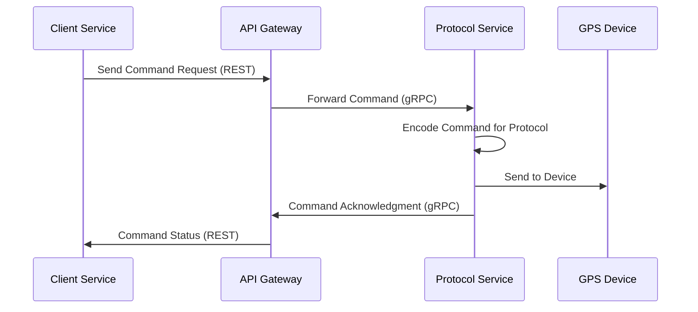

# Protocol Service Command API

## Overview

The Protocol Service Command API enables other microservices to send commands to connected devices. This API allows for remote control of devices through protocol-specific command encoding and delivery mechanisms.

## Command Execution Flow



1. **Request Initiation**: A client service (typically the API Gateway) sends a command request to the Protocol Service via gRPC.
2. **Command Encoding**: The Protocol Service identifies the target device's protocol and encodes the command into the appropriate format.
3. **Command Delivery**: The encoded command is sent to the connected device through the established communication channel.
4. **Synchronous Acknowledgment**: The Protocol Service immediately returns an acknowledgment indicating whether the command was successfully sent to the device.
5. **Asynchronous Status Updates**: For commands with delayed execution, status updates may be published to the message broker for asynchronous notification.

## API Specification

### Command Request

```protobuf
message CommandRequest {
  int64 deviceId = 1;        // Unique device identifier
  string type = 2;           // Command type (e.g., "positionSingle", "engineStop")
  map<string, string> attributes = 3;  // Command-specific parameters
  int32 timeoutSeconds = 4;  // Optional timeout in seconds (default: 60)
}
```

### Command Response

```protobuf
message CommandResponse {
  enum Status {
    SUCCESS = 0;             // Command successfully sent to device
    DEVICE_NOT_CONNECTED = 1; // Device is not currently connected
    PROTOCOL_NOT_SUPPORTED = 2; // Device protocol doesn't support this command
    ENCODING_FAILED = 3;     // Failed to encode command for device
    DELIVERY_FAILED = 4;     // Failed to deliver command to device
    INVALID_COMMAND = 5;     // Command type or parameters are invalid
    TIMEOUT = 6;             // Command delivery timed out
  }
  
  Status status = 1;         // Command execution status
  string message = 2;        // Human-readable status message
  string correlationId = 3;  // Unique identifier for tracking this command
}
```

### gRPC Service Definition

```protobuf
service CommandService {
  // Send a command to a device
  rpc SendCommand(CommandRequest) returns (CommandResponse);
  
  // Check status of a previously sent command
  rpc GetCommandStatus(CommandStatusRequest) returns (CommandStatusResponse);
}
```

## Supported Command Types

The Protocol Service supports various command types, with availability depending on the device protocol capabilities:

| Command Type | Description | Required Attributes | Supported Protocols |
|--------------|-------------|---------------------|---------------------|
| `positionSingle` | Request a single position update | None | Most protocols |
| `positionPeriodic` | Configure periodic reporting | `frequency` (seconds) | Most protocols |
| `positionStop` | Stop periodic reporting | None | Most protocols |
| `engineStop` | Remotely stop vehicle engine | None | GT06, Teltonika, Meitrack, etc. |
| `engineResume` | Remotely resume vehicle engine | None | GT06, Teltonika, Meitrack, etc. |
| `alarmArm` | Arm the alarm system | None | Selected protocols |
| `alarmDisarm` | Disarm the alarm system | None | Selected protocols |
| `setTimezone` | Set device timezone | `timezone` (e.g., "Europe/London") | Selected protocols |
| `requestPhoto` | Request camera photo | None | Protocols with camera support |
| `configuration` | Send configuration parameters | Protocol-specific | Most protocols |
| `custom` | Send custom command | `data` (command string) | All protocols |
| `rebootDevice` | Reboot the device | None | Most protocols |
| `factoryReset` | Reset device to factory settings | None | Selected protocols |
| `setConnection` | Change device server connection | `server`, `port` | Selected protocols |
| `setOutputControl` | Control digital outputs | `index`, `state` | Protocols with I/O support |

## Protocol-Specific Command Formats

Each protocol implements its own command encoding logic. The Protocol Service automatically selects the appropriate encoder based on the device's protocol:

### Example: GT06 Protocol

```
positionSingle: "(000000,A01)"
engineStop: "(000000,A12,0)"
engineResume: "(000000,A12,1)"
```

### Example: Teltonika Protocol

Commands are encoded as hexadecimal strings:

```
positionSingle: "AVL_SNAPSHOT"
rebootDevice: "REBOOT"
setOutputControl: "setdigout 1 1" (for output 1, state 1)
```

## Error Handling

The Protocol Service implements robust error handling for command execution:

1. **Device Connectivity Check**: Before attempting to send a command, the service verifies that the device is currently connected.

2. **Protocol Support Validation**: The service checks whether the requested command type is supported by the device's protocol.

3. **Parameter Validation**: Command attributes are validated against protocol-specific requirements.

4. **Encoding Error Handling**: If command encoding fails, a detailed error is returned.

5. **Delivery Timeouts**: Commands include configurable timeouts to prevent indefinite waiting for acknowledgment.

6. **Circuit Breakers**: External service calls use circuit breakers to prevent cascading failures.

## Example Usage

### Java Client Example

```java
CommandServiceGrpc.CommandServiceBlockingStub commandService = 
CommandServiceGrpc.newBlockingStub(channel);


CommandRequest request = CommandRequest.newBuilder()
    .setDeviceId(123456)
    .setType("engineStop")
    .putAttributes("reason", "Remote shutdown requested")
    .setTimeoutSeconds(30)
    .build();

try {
    CommandResponse response = commandService.sendCommand(request);
    if (response.getStatus() == CommandResponse.Status.SUCCESS) {
        System.out.println("Command sent successfully: " + response.getCorrelationId());
    } else {
        System.err.println("Command failed: " + response.getMessage());
    }
} catch (StatusRuntimeException e) {
    System.err.println("RPC failed: " + e.getStatus());
}
```

### REST API Example (via API Gateway)

```
POST /api/commands
Content-Type: application/json
Authorization: Bearer {token}

{
  "deviceId": 123456,
  "type": "positionSingle",
  "attributes": {},
  "timeoutSeconds": 30
}
```

Response:

```json
{
  "status": "SUCCESS",
  "message": "Command sent successfully",
  "correlationId": "cmd-8a7d9f3b-e4c2-4d5a-b8a1-7c6e2d3f1e0a"
}
```

## Limitations and Considerations

1. **Protocol Support**: Not all commands are supported by all protocols. Check the device protocol documentation for supported commands.

2. **Device State**: Commands can only be sent to online devices with active connections to the Protocol Service.

3. **Command Queuing**: The Protocol Service does not queue commands for offline devices. Client services must implement their own queuing if required.

4. **Rate Limiting**: To prevent device flooding, commands to the same device may be rate-limited.

5. **Authentication**: The Command API requires proper authentication and authorization. Only authorized services can send commands to devices.

6. **Idempotency**: Command requests should include a unique identifier for idempotent execution if retries are needed.

## Troubleshooting

| Issue | Possible Causes | Resolution |
|-------|----------------|------------|
| `DEVICE_NOT_CONNECTED` | Device is offline or has no active session | Verify device connectivity status before sending commands |
| `PROTOCOL_NOT_SUPPORTED` | The command type is not supported by the device protocol | Check protocol documentation for supported commands |
| `ENCODING_FAILED` | Invalid command parameters or protocol encoder error | Verify command attributes match protocol requirements |
| `DELIVERY_FAILED` | Network issues or device not responding | Check network connectivity and device status |
| `INVALID_COMMAND` | Malformed command request | Verify command format and required attributes |
| `TIMEOUT` | Device did not acknowledge the command in time | Increase timeout or check device responsiveness |