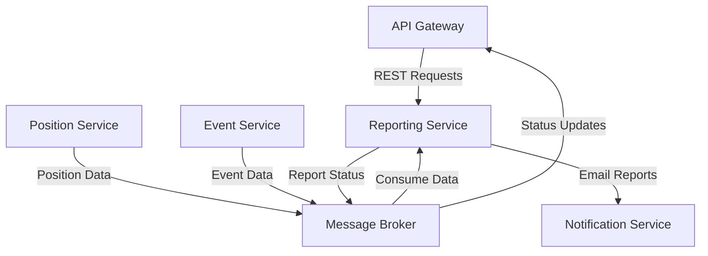

# Traccar Reporting Service

## Overview

The Reporting Service is a critical component of the Traccar GPS tracking system's microservices architecture, responsible for generating, scheduling, and distributing various report types to provide insights into device activity, routes, events, and performance metrics. This service enables data-driven decision making, provides documentation for compliance purposes, and facilitates performance benchmarking and operational analysis.

## Architecture

The Reporting Service is designed as a standalone microservice within the Traccar ecosystem, following modern containerized application principles. It communicates with other services primarily through asynchronous messaging via a message broker (Kafka/RabbitMQ) and exposes a REST API for direct report requests.

### Key Components

- **Report Generators**: Specialized components for each report type (route, events, summary, trips, stops)
- **Export Formatters**: Handlers for different output formats (Excel, PDF, CSV, JSON)
- **Report Scheduler**: Background job scheduler for recurring report generation
- **Message Consumers**: Listeners for position and event data from the message broker
- **REST API**: Endpoints for on-demand report generation and management

### Service Interactions



## Features

### Report Types

- **Route Reports**: Detailed device movement history with path visualization
- **Event Reports**: Chronological listing of system events with filtering options
- **Summary Reports**: Aggregated statistics on device usage and performance
- **Trip Reports**: Analysis of individual trips with start/stop points and statistics
- **Stop Reports**: Details on vehicle stops including duration and location

### Output Formats

- **Excel**: Formatted spreadsheets with charts and multiple sheets
- **PDF**: Printable documents with branding and formatting
- **CSV**: Raw data export for further processing
- **JSON**: Structured data for API consumers

### Scheduling Capabilities

- One-time report generation
- Recurring reports (daily, weekly, monthly)
- Custom schedule definitions
- Time zone-aware scheduling

### Delivery Options

- Direct download via API
- Email delivery with attachments
- Secure link sharing
- Storage in user's report library

## Configuration

The Reporting Service can be configured through environment variables, configuration files, or Kubernetes ConfigMaps.

### Core Configuration Options

```yaml
reporting:
  # Database connection settings
  database:
    url: jdbc:postgresql://database:5432/traccar
    username: ${DB_USER}
    password: ${DB_PASSWORD}
    maxPoolSize: 10
    
  # Message broker settings
  broker:
    type: kafka  # or rabbitmq
    bootstrapServers: kafka:9092
    consumerGroup: reporting-service
    
  # Report generation settings
  reports:
    maxConcurrent: 5
    defaultTimeZone: UTC
    tempDirectory: /tmp/reports
    
  # Export settings
  export:
    excel:
      templateDirectory: /app/templates/excel
    pdf:
      templateDirectory: /app/templates/pdf
      
  # Scheduling settings
  scheduler:
    threadPoolSize: 3
    
  # Service discovery settings
  discovery:
    serviceName: reporting-service
    registerWithConsul: true
    consulHost: consul
    consulPort: 8500
```

### Environment Variables

| Variable | Description | Default |
|----------|-------------|---------|
| `REPORTING_DB_URL` | Database connection URL | jdbc:postgresql://database:5432/traccar |
| `REPORTING_DB_USER` | Database username | traccar |
| `REPORTING_DB_PASSWORD` | Database password | *Required* |
| `REPORTING_BROKER_TYPE` | Message broker type (kafka/rabbitmq) | kafka |
| `REPORTING_BROKER_SERVERS` | Broker connection string | kafka:9092 |
| `REPORTING_MAX_CONCURRENT` | Maximum concurrent report generations | 5 |
| `REPORTING_DEFAULT_TIMEZONE` | Default timezone for reports | UTC |
| `REPORTING_TEMPLATE_DIR` | Directory containing report templates | /app/templates |

## API Documentation

The Reporting Service exposes a RESTful API for report management and generation.

### Endpoints

#### Generate Report

```
POST /api/reports/generate
```

Request body:
```json
{
  "type": "route",
  "deviceId": 123,
  "groupId": null,
  "from": "2023-06-01T00:00:00Z",
  "to": "2023-06-30T23:59:59Z",
  "format": "excel",
  "includeMap": true,
  "timezone": "America/New_York"
}
```

Response:
```json
{
  "id": "report-2023-07-01-123456",
  "status": "processing",
  "url": null,
  "estimatedCompletionTime": "2023-07-01T12:05:30Z"
}
```

#### Get Report Status

```
GET /api/reports/{reportId}
```

Response:
```json
{
  "id": "report-2023-07-01-123456",
  "status": "completed",
  "url": "https://api.traccar.org/api/reports/download/report-2023-07-01-123456",
  "completedAt": "2023-07-01T12:05:28Z"
}
```

#### Download Report

```
GET /api/reports/download/{reportId}
```

Returns the report file with appropriate Content-Type header.

#### List Scheduled Reports

```
GET /api/reports/schedule
```

Response:
```json
[
  {
    "id": 45,
    "name": "Weekly Route Report",
    "type": "route",
    "deviceId": 123,
    "schedule": "0 0 8 ? * MON",
    "format": "excel",
    "recipients": ["user@example.com"],
    "includeMap": true,
    "timezone": "America/New_York",
    "enabled": true,
    "createdAt": "2023-07-01T10:15:30Z",
    "lastRun": "2023-07-03T08:00:00Z",
    "nextRun": "2023-07-10T08:00:00Z"
  },
  {
    "id": 46,
    "name": "Monthly Summary Report",
    "type": "summary",
    "groupId": 5,
    "schedule": "0 0 9 1 * ?",
    "format": "pdf",
    "recipients": ["manager@example.com"],
    "includeMap": false,
    "timezone": "Europe/London",
    "enabled": true,
    "createdAt": "2023-06-15T14:22:10Z",
    "lastRun": "2023-07-01T09:00:00Z",
    "nextRun": "2023-08-01T09:00:00Z"
  }
]
```

#### Schedule Report

```
POST /api/reports/schedule
```

Request body:
```json
{
  "name": "Weekly Route Report",
  "type": "route",
  "deviceId": 123,
  "schedule": "0 0 8 ? * MON",
  "format": "excel",
  "recipients": ["user@example.com"],
  "includeMap": true,
  "timezone": "America/New_York",
  "enabled": true
}
```

Response:
```json
{
  "id": 45,
  "name": "Weekly Route Report",
  "type": "route",
  "deviceId": 123,
  "schedule": "0 0 8 ? * MON",
  "format": "excel",
  "recipients": ["user@example.com"],
  "includeMap": true,
  "timezone": "America/New_York",
  "enabled": true,
  "createdAt": "2023-07-01T10:15:30Z"
}
```

## Integration with Other Services

The Reporting Service integrates with several other microservices in the Traccar ecosystem:

### Message Broker Integration

The service subscribes to the following topics:

- `position-updates`: Consumes position data for report generation
- `event-updates`: Consumes event data for report generation
- `report-requests`: Listens for report generation requests

And publishes to:

- `report-status`: Updates on report generation progress
- `notification-requests`: Requests to send email notifications with reports

### Service Discovery

The Reporting Service registers with the service discovery mechanism (Consul/Kubernetes) to enable other services to locate it dynamically. This registration includes:

- Service name and ID
- Health check endpoints
- Service metadata

### API Gateway Integration

The API Gateway routes external requests to the Reporting Service based on path patterns:

```yaml
apiVersion: networking.k8s.io/v1
kind: Ingress
metadata:
  name: api-gateway
  annotations:
    nginx.ingress.kubernetes.io/rewrite-target: /$2
spec:
  rules:
  - http:
      paths:
      - path: /api/reports(/|$)(.*)
        pathType: Prefix
        backend:
          service:
            name: reporting-service
            port:
              number: 8080
```

## Deployment

The Reporting Service is designed to be deployed as a containerized application in a Kubernetes environment.

### Docker Image

The service is packaged as a Docker image available at `traccar/reporting-service:latest`.

### Kubernetes Deployment

```yaml
apiVersion: apps/v1
kind: Deployment
metadata:
  name: reporting-service
spec:
  replicas: 2
  selector:
    matchLabels:
      app: reporting-service
  template:
    metadata:
      labels:
        app: reporting-service
    spec:
      containers:
      - name: reporting-service
        image: traccar/reporting-service:latest
        ports:
        - containerPort: 8080
        env:
        - name: REPORTING_DB_URL
          valueFrom:
            configMapKeyRef:
              name: traccar-config
              key: database-url
        - name: REPORTING_DB_USER
          valueFrom:
            secretKeyRef:
              name: traccar-secrets
              key: database-user
        - name: REPORTING_DB_PASSWORD
          valueFrom:
            secretKeyRef:
              name: traccar-secrets
              key: database-password
        - name: REPORTING_BROKER_SERVERS
          valueFrom:
            configMapKeyRef:
              name: traccar-config
              key: kafka-servers
        resources:
          requests:
            memory: "512Mi"
            cpu: "500m"
          limits:
            memory: "1Gi"
            cpu: "1000m"
        livenessProbe:
          httpGet:
            path: /actuator/health/liveness
            port: 8080
          initialDelaySeconds: 60
          periodSeconds: 15
        readinessProbe:
          httpGet:
            path: /actuator/health/readiness
            port: 8080
          initialDelaySeconds: 30
          periodSeconds: 10
```

### Horizontal Pod Autoscaler

```yaml
apiVersion: autoscaling/v2
kind: HorizontalPodAutoscaler
metadata:
  name: reporting-service-hpa
spec:
  scaleTargetRef:
    apiVersion: apps/v1
    kind: Deployment
    name: reporting-service
  minReplicas: 2
  maxReplicas: 5
  metrics:
  - type: Resource
    resource:
      name: cpu
      target:
        type: Utilization
        averageUtilization: 70
```

## Troubleshooting

### Common Issues

#### Report Generation Failures

**Symptoms:**
- Report status stuck in "processing"
- Error messages in logs

**Possible Causes:**
- Insufficient memory for large reports
- Database connectivity issues
- Template file missing or corrupted

**Resolution:**
- Check service logs: `kubectl logs deployment/reporting-service`
- Verify database connectivity
- Ensure template files are correctly mounted
- Increase memory limits if necessary

#### Scheduled Reports Not Running

**Symptoms:**
- Scheduled reports not being generated at expected times

**Possible Causes:**
- Scheduler service not running
- Incorrect timezone configuration
- Invalid cron expression

**Resolution:**
- Check scheduler logs
- Verify timezone settings
- Validate cron expressions using a cron expression validator

### Logging

The Reporting Service uses structured JSON logging with the following log levels:

- `ERROR`: Critical issues that prevent report generation
- `WARN`: Non-critical issues that might affect report quality
- `INFO`: Normal operational events
- `DEBUG`: Detailed information for troubleshooting

Example log query in Kibana:

```
kubernetes.container.name:reporting-service AND log.level:ERROR
```

### Metrics

The service exposes Prometheus-compatible metrics at `/actuator/prometheus` including:

- `report_generation_duration_seconds`: Histogram of report generation times
- `report_generation_total`: Counter of reports generated
- `report_generation_failures_total`: Counter of failed report generations
- `scheduled_reports_total`: Gauge of currently scheduled reports
- `active_report_generations`: Gauge of currently running report generations

## License

Apache License, Version 2.0